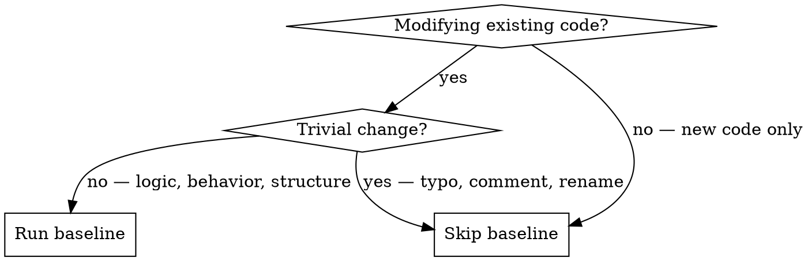

# Baseline — Regression Safety Net

Capture the state of tests and behavior BEFORE modifying code, so you can compare AFTER.

**Announce at start:** "Running aria:baseline to capture the current state before changes."

## When to Use



## The Process

### Step 1: Identify Scope

Determine what code will be modified and what depends on it.

- Which files/functions/classes are changing?
- What calls or depends on this code? (grep for usages)
- Which test categories are relevant? (unit, integration, performance)

### Step 2: Run Existing Tests

Run the relevant test suites and capture results. Use the test commands defined in the project's CLAUDE.md or documentation.

**Test tiers (run from fastest to most relevant):**

1. **Unit tests** (fast, always run) — the project's default/fast test command
2. **Integration tests** (if touching services, DB, or APIs) — tests that hit real infrastructure
3. **Performance tests** (if touching hot paths or optimization work) — benchmarks and perf suites
4. **Specific tests** (if you know exactly what's relevant) — targeted test filter

Check the project's CLAUDE.md for the exact test commands and filters.

Save results as the baseline reference.

### Step 3: Coverage Analysis

For each function/class being modified, assess:

```
## Coverage Analysis: [ComponentName]

**Covered:**
- [Scenario] — [how it's tested]
- [Scenario] — [how it's tested]

**Not covered:**
- [Scenario] — [risk level: HIGH/MEDIUM/LOW]
- [Scenario] — [risk level: HIGH/MEDIUM/LOW]

**Highest risk:** [identify the most dangerous gap]
```

**Risk assessment criteria:**
- **HIGH:** Code path handles money, permissions, data integrity, cascading operations, security boundaries, tenant/user isolation
- **MEDIUM:** Code path handles business logic, data transformation, user-facing behavior
- **LOW:** Code path handles formatting, display, non-critical defaults

Adapt these criteria to the project's domain — check `docs/patterns/` or CLAUDE.md for project-specific risk areas.

### Step 4: Write Missing Regression Tests

For HIGH and MEDIUM risk gaps:

1. Write a regression test that captures CURRENT behavior (even if the behavior is wrong — document it)
2. Run the test — it MUST pass against the current code
3. Commit separately: `test: add regression test for [component] before refactor`

This test becomes your safety net. If your changes break existing behavior, this test will catch it.

**Test granularity:**
- Modifying a pure function or isolated logic → unit test
- Modifying a service that touches DB or external systems → integration test
- Modifying a cross-cutting flow (API → service → DB → events) → integration test covering the full cycle

Follow the project's existing test patterns — check how similar components are tested in the test suite.

### Step 5: Capture Performance Baseline (if applicable)

Only when the change involves optimization or touches performance-critical code:

1. Run the relevant performance tests
2. Record the metrics (execution time, memory, etc.)
3. These become the comparison point after implementation

## Output

Present to the human:

```
## Baseline Captured

**Tests run:** [N passed, M failed (pre-existing), K skipped]
**Pre-existing failures:** [list any tests that already fail — these are NOT your fault]

**Coverage analysis:**
[coverage table from Step 3]

**Regression tests added:** [N new tests — or "None needed, coverage is adequate"]
**Performance baseline:** [metrics — or "N/A"]

Ready to begin implementation.
```

## After Implementation (Comparison)

When called after implementation to compare:

1. Run the exact same test commands as the baseline
2. Compare results:
   - **New failures** = regressions → STOP, fix before proceeding
   - **Pre-existing failures still failing** = not your problem (but note them)
   - **Previously failing now passing** = bonus, note it
3. Run new tests written during implementation
4. Compare performance metrics if applicable

```
## Regression Check

**Before:** [N passed, M failed]
**After:** [N+X passed, M-Y failed]

**Regressions:** [NONE — or list of new failures]
**Improvements:** [tests that now pass that didn't before]
**New tests:** [K new tests, all passing]
**Performance:** [same / improved / degraded by X%]
```

## Integration

- **aria:exec** — calls baseline in Step 2 (HARD/MEDIUM modes)
- **aria:exec** — calls baseline comparison after each task
- Can be invoked standalone: `/baseline` to assess current state
