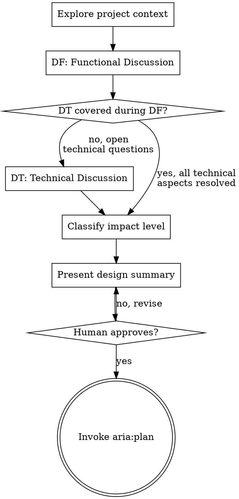

# Design — Functional & Technical Discussion

Turn ideas into validated designs through two interleaved discussions: the Functional Discussion (DF) explores what and why, the Technical Discussion (DT) explores how and at what cost.

**Announce at start:** "Using aria:design to explore this idea."

## The Iron Law

```
NO IMPLEMENTATION WITHOUT A VALIDATED DESIGN
```

Every change goes through this process. A config change, a bugfix, a refactor — all of them. The design can be 3 sentences for simple changes, but it MUST exist and be approved.

## The Two Discussions

### DF — Discussion Fonctionnelle (What & Why)

- What is the need?
- Why implement this?
- Are there alternatives?
- Is this legitimate? (YAGNI check)
- What does success look like?
- What are the constraints?

### DT — Discussion Technique (How & At What Cost)

- How do we implement this?
- What's the impact on existing code?
- What are the technical risks?
- What's the performance impact?
- What's the testing strategy?
- What's the impact level? (determines exec mode)

## Process Flow



## The Process

### Step 1: Explore Context

Before asking questions, understand the current state:
- Check relevant files, docs, recent commits
- Understand the existing architecture in the affected area
- **Read `docs/patterns/`** if it exists — these are the project's recurring patterns and conventions. Any design must be consistent with documented patterns. If no patterns doc exists yet, note it and explore the codebase to identify conventions manually.
- If `.aria/project.md` exists, read it for project context (structure, conventions, known complexity). If `.aria/learnings.md` exists, scan for learnings relevant to this design. **Never create `.aria/`** — skip silently if absent.
- **OpenSpec detection**: if an `openspec/` directory exists at the project root, this project uses the OpenSpec workflow for change management. Run `openspec list --json` to see active changes. If a change relevant to this design already exists, read its artifacts (`openspec/changes/<name>/proposal.md`, `design.md`, `tasks.md`) for context. The `openspec-explore` skill is available as a thinking partner during the DF/DT discussions if depth is needed.

### Step 2: DF — Functional Discussion

Ask questions **one at a time** to understand the need:

- Prefer multiple choice questions when possible
- One question per message — don't overwhelm
- Focus on: purpose, constraints, success criteria, user impact
- Challenge the request when appropriate — "is this really needed?" is a valid question

**The DT can interrupt the DF.** When a functional question naturally leads to a technical consideration, explore the technical angle immediately rather than deferring it. Then return to the DF.

**Examples of DT interrupting DF:**

- DF: "Should we support bulk operations?" → DT interrupts: "Bulk operations would require changing the data access layer to handle batched writes — that's a significant change to a critical path. Worth knowing before we decide."
- DF: "Should notifications be real-time?" → DT interrupts: "We already have a websocket/event infrastructure in place. Real-time is almost free to add. Push notifications would be a whole new infrastructure."
- DF: "Can we add an export feature?" → DT interrupts: "The existing codebase already has a report generation pipeline. We could hook into that rather than build from scratch."

The pattern: **the DT surfaces cost/feasibility information that changes the functional decision.** If it doesn't change the decision, it can wait for Step 3.

### Step 3: DT Check

After the DF is complete, assess whether all technical aspects have been covered:

> "On the technical side, we discussed [X] and [Y] during the functional discussion. Are there remaining technical questions to address before planning? (architecture, patterns, performance, compatibility, testing strategy...)"

**If everything was covered during DF:** skip to Step 4.
**If open technical questions remain:** conduct the DT.

### Step 3.1: DT — Technical Discussion

Explore the remaining technical aspects:

- How does this fit into the existing architecture?
- What existing code needs to change?
- What are the risks? (breaking changes, performance, data integrity)
- What's the testing strategy? (unit, integration, e2e)
- Are there alternative technical approaches?

Propose 2-3 approaches with trade-offs when relevant. Lead with your recommendation.

### Step 4: Classify Impact Level

Based on the DF and DT, classify the change:

| Level | Description | Exec Mode | Baseline |
|-------|-------------|-----------|----------|
| **Refacto complet** | Restructures architecture, changes fundamental patterns | HARD | Required — full suite |
| **Refacto** | Modifies existing code structure, interfaces stable | MEDIUM | Required — affected areas |
| **Ajout** | Adds new code without modifying existing logic | EASY | Not required |
| **Suppression** | Removes code or features | MEDIUM | Required — dependents |

Present the classification to the human for confirmation.

### Step 5: Present Design Summary

Scale to complexity — a few sentences for simple changes, detailed sections for complex ones:

```
## Design Summary

**Need:** [1 sentence]
**Approach:** [1-3 sentences]
**Impact level:** [level] → exec mode [HARD/MEDIUM/EASY]

**Key decisions:**
- [Decision 1 — and why]
- [Decision 2 — and why]

**Risks:**
- [Risk 1 — mitigation]

**Testing strategy:**
- [What to test and how]
```

Get explicit approval before proceeding.

### Step 5.1: Write Spec Document

After the human approves the design summary, persist it.

**OpenSpec is aria's default backend for design artifacts.** It provides traceability (proposal/design/tasks artifacts, archived per change), spec sync (delta specs merged into main specs on archive), and a CLI (`openspec status`, `openspec list`, etc.) that aria:plan and aria:exec rely on.

**Decision tree:**

1. **`openspec/` directory exists** → use OpenSpec. Skip to step (3).

2. **`openspec/` directory does not exist** → decide whether to bootstrap.
   - **For non-trivial changes** (Refacto complet / Refacto / multi-task Ajout / Suppression): bootstrap OpenSpec. Run:
     ```bash
     openspec init . --tools claude
     ```
     Then proceed to step (3). Commit the init separately: `chore: initialize openspec workflow`.
   - **For trivial changes** (1-2 task Ajout, simple bugfix, doc tweak): skip OpenSpec. Save to `docs/specs/YYYY-MM-DD-<topic>.md` and commit `docs: design spec for <topic>`. Done.
   - **If unsure**: ask the human via AskUserQuestion: "Bootstrap OpenSpec for this change? (recommended for non-trivial work — gives traceable artifacts and spec sync)".

3. **OpenSpec mode** (either was present, or just bootstrapped):
   - Delegate to the **`openspec-propose`** skill, passing the design summary as input. It will scaffold `openspec/changes/<change-name>/` with `proposal.md`, `design.md`, and `tasks.md` (or whatever artifacts the active schema requires).
   - The aria design summary content (Need / Approach / Impact level / Key decisions / Risks / Testing strategy) maps onto the OpenSpec proposal + design artifacts — the openspec-propose skill handles the formatting per the schema.
   - Record the OpenSpec change name in the conversation; aria:plan and aria:exec will reuse it.
   - Commit: `docs: openspec proposal for <change-name>` (or whatever the schema's convention is — check existing commits in `openspec/changes/`).

User preferences for spec location override these defaults.

The spec doc (or OpenSpec proposal) drives the implementation plan — aria:plan reads it as input. Keep it concise: the design summary content is sufficient, don't pad it.

### Step 6: Transition to Planning

After approval:

> "Design validated. Invoking aria:plan to create the implementation plan."

Invoke aria:plan. Do NOT start implementation directly.

## Key Principles

- **One question at a time** — don't overwhelm
- **Challenge when appropriate** — "do we really need this?" is valuable
- **DT can interrupt DF** — technical reality informs functional decisions
- **YAGNI ruthlessly** — remove unnecessary features from all designs
- **The design can be short** — 3 sentences for a bugfix is fine
- **Working in existing codebases** — follow existing patterns, don't propose unrelated refactoring

## Integration

- **aria:plan** — the ONLY next step after design is validated
- **aria:exec** — can return to design mid-execution when reality doesn't match the plan
- **openspec-explore** (OpenSpec mode) — optional thinking partner during DF/DT for deep exploration; auto-detected when `openspec/` exists
- **openspec-propose** (OpenSpec mode) — invoked at Step 5.1 to write OpenSpec artifacts instead of `docs/specs/`; auto-detected when `openspec/` exists
