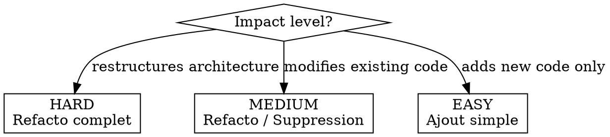

# Stepwise Execution

Execute a plan one task at a time with human checkpoints between each task.

**Announce at start:** "Using aria:exec to implement this plan in [mode] mode."

## The Iron Laws

```
1. TESTS ARE WRITTEN WITH THE TASK, NEVER AFTER
2. TESTS VERIFY EXPECTED BEHAVIOR, NOT IMPLEMENTATION DETAILS
3. ONE TASK = ONE COMMIT
4. NEVER PROCEED TO THE NEXT TASK WITHOUT HUMAN APPROVAL
5. EVIDENCE BEFORE CLAIMS — run tests, show output, then report
```

**Violating the letter of these rules is violating the spirit of these rules.**

### Anti-Rationalization Table

| Excuse | Reality |
|--------|---------|
| "I'll add tests after all tasks are done" | No. Tests are part of the task. A task without tests is incomplete. |
| "This task is too simple to test" | Simple code breaks. Write the test. 30 seconds. |
| "Let me batch the next few tasks, they're trivial" | Each task gets a checkpoint. No exceptions unless the human says otherwise. |
| "Tests will be easier once the scaffolding is done" | Tests DRIVE the scaffolding. TDD, not TDA (Test-Driven Afterthought). |
| "I'll consolidate tests at the end" | Consolidating = skipping. Write tests now. |
| "Let me test the internal implementation" | Test WHAT the code does, not HOW. Tests coupled to implementation break on every refactor. |
| "The human seems busy, I'll keep going" | Stop. Wait. That's the whole point. |

## Execution Modes

The mode is determined by the impact level set during aria:design, or chosen explicitly by the user.



### HARD Mode (Refacto complet)

- **REQUIRED:** Run aria:baseline before first task
- **Briefing:** Full task description + files + rationale + risks
- **Execution:** Direct (no subagent) — user sees everything
- **Debriefing:** Compact diff + test results + regression comparison
- **Review:** Adaptive — rediscuss design if needed, can revise plan
- **Between tasks:** Mandatory checkpoint, no batching

### MEDIUM Mode (Refacto / Suppression)

- **REQUIRED:** Run aria:baseline on affected areas
- **Briefing:** Task description + files involved
- **Execution:** Subagent OK if task is well-scoped (single testable objective)
- **Debriefing:** Compact diff + test results
- **Review:** Active — user approves or requests adjustments
- **Between tasks:** Mandatory checkpoint, user can fast-track ("do the next 2")

### EASY Mode (Ajout simple)

- **Briefing:** Short summary (2-3 lines)
- **Execution:** Subagent OK
- **Debriefing:** Compact diff + test results
- **Review:** Light — user confirms to continue
- **Between tasks:** Checkpoint, but user can batch ("do the next 3")
- **No baseline required** (new code only)

## The Execution Loop

For each task in the plan:

### Step 1: BRIEFING

Present the task to the human:

```
## Task N/Total: [Task Name]

**What:** [1-3 sentence description]
**Files:** [list of files to create/modify]
**Why:** [how this connects to the previous task and the overall goal]
[HARD mode only] **Risks:** [what could go wrong]

Ready to proceed?
```

Wait for confirmation. Do NOT start implementation before the human says go.

### Step 2: BASELINE (HARD/MEDIUM only)

If modifying existing code non-trivially:
1. Invoke aria:baseline to capture current test state
2. If no relevant tests exist, write a regression test FIRST (before touching implementation code)
3. Show baseline results to the human

### Step 3: EXECUTE

Implement the task following TDD:

```
Write failing test → Run (RED) → Implement → Run (GREEN) → Refactor → Run (GREEN) → Commit
```

**Rules during execution:**
- Follow the plan's steps exactly
- **Read `docs/patterns/` before writing code** — follow project conventions, no shortcuts
- If something doesn't work as planned: STOP, don't hack around it
- If the task is harder than expected: STOP, surface to human
- If you discover something that impacts future tasks: note it for the debriefing
- If `.aria/project.md` exists, follow its documented conventions. **Never create `.aria/`.**

**After implementation, commit immediately:**
```bash
git add <specific files>
git commit -m "feat/fix/refactor: <what this task achieves>"
```

### Step 4: AUTO-REVIEW (subagent)

Before presenting results to the human, dispatch a review subagent to check:
- Correctness against the task's objective
- Adherence to `docs/patterns/` conventions (no magic strings, no hardcoded values, follows project idioms)
- Obvious security or performance issues
- Test quality (meaningful assertions, not implementation-coupled)

If the auto-review finds **BLOCKER** issues: fix them before debriefing.
If it finds **WARNING/SUGGESTION**: include them in the debriefing.

### Step 5: DEBRIEFING

Present results to the human:

```
## Task N/Total Complete

**Changes:**
[git diff HEAD~1 output — compact diff]

**Tests:**
[test output — pass/fail count]

[HARD/MEDIUM] **Regression:**
[comparison with baseline — any regressions?]

**Auto-review:**
[BLOCKER/WARNING/SUGGESTION items — or "No issues found"]

**Discoveries:**
[anything that affects future tasks — or "None"]
```

Open modified files in the user's editor (check CLAUDE.md for editor command).

### Step 6: HUMAN REVIEW

Wait for the human's response. They can:

- **Approve** → proceed to next task
- **Request adjustments** → fix, re-test, amend commit, re-present
- **Fast-track** (MEDIUM/EASY) → "do the next N tasks" — execute N tasks, but still commit and show diff for each
- **Revise plan** → update the task file(s) in the plan, then continue
- **Return to design** → invoke aria:design to rethink the approach
- **Abort** → invoke aria:abort for clean shutdown

## Returning to Design Mid-Execution

This is expected, not exceptional. When the human (or you) realizes the plan doesn't match reality:

1. STOP execution
2. State clearly: "Task N revealed [problem]. The plan assumed [X] but reality is [Y]."
3. Propose: return to design (aria:design) or revise just the affected tasks
4. If revising tasks: update the task files, update the meta-plan status, continue
5. If returning to design: the meta-plan preserves completed task state — nothing is lost

## Handling Discoveries During Execution

When Task N reveals something that impacts Task M (future):

1. Immediately update `task-M-*.md` with a `> [!WARNING]` block noting the discovery
2. Add a note in the meta-plan under Task M
3. Surface it in the Task N debriefing
4. The human decides: revise now or handle when we get there

## Subagent Usage

When using subagents (MEDIUM/EASY modes):

- **One subagent per task** — never batch multiple tasks
- **Task must have a single testable objective** — "implement function X" not "build feature Y"
- **Provide:** task file content + relevant context files + `docs/patterns/` conventions + test patterns from the project
- **Expect:** implementation + tests + commit
- **After subagent returns:** verify independently (run tests yourself), show diff, open in editor
- **Never trust subagent success claims** — always verify

## Session Boundaries

If this session ends before all tasks are complete:
1. Update the meta-plan with current status (which tasks done, which in progress)
2. Note any discoveries or plan revisions in the meta-plan
3. The human can resume with aria:resume-plan in a new session

## Completion

After all tasks are done:

1. Run the full test suite (including regression/integration if applicable)
2. Show final summary: all tasks, all commits, total changes
3. Offer: aria:review for a full code review of all changes
4. Offer: merge strategy (squash, merge commit, rebase)
5. If `.aria/` exists: offer aria:learn to capture session learnings

## Red Flags — STOP Immediately

- You're about to implement without tests → STOP, write the test first
- You're about to move to the next task without showing results → STOP, debrief first
- A test fails and you don't understand why → STOP, investigate before proceeding
- The plan says one thing but the code says another → STOP, surface to human
- You're tempted to "just quickly do the next task too" → STOP, that's the checkpoint

## Integration

- **aria:baseline** — called during Step 2 for regression safety
- **aria:plan** — creates the plan this skill executes
- **aria:design** — return to design when reality doesn't match plan
- **aria:review** — code review after all tasks or per-task in HARD mode
- **aria:resume-plan** — resume execution in a new session
- **aria:abort** — clean shutdown
